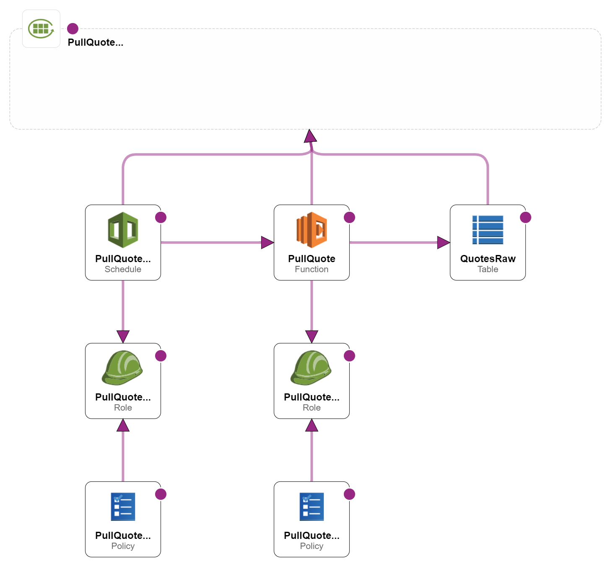

<div align="center">
    <h1>Serverless AWS ELT Demo</h1>
    <i>A learning repo to demo a cheap, fast, and serveless data stack</i>
</div>
<br>
<p align="center">
  
  
</p>
 
## Introduction
This is a lightweight demonstration of a serverless stack to extract data from an API, apply minor transformations, and load the data to a sink. All of this is built on AWS serverless infrastructure, which results in an extremely cheap, fast, and infinitely scalable template.

All of the infrastracture is created and modified via IaC (infrastructure as code) using Terraform.

This project is entirely free to run on the AWS "Always Free Tier", assuming you don't have heavy load across DynamoDB, Lambda, or EventBridge Scheduler elsewhere that takes you over the limit.


## Table of Contents
- [Introduction](#introduction)
- [Table of Contents](#table-of-contents)
- [Purpose](#purpose)
- [Architecture](#architecture)
    - [Explained in a bit more verbose way](#explained-in-a-bit-more-verbose-way)
- [API Used](#api-used)
- [Setting Up the Project](#setting-up-the-project)
- [Credits](#credits)
- [License](#license)


## Purpose
Ultimately, there is not much point beyond being a teaching resource, and demonstrating best practices across a fairly modern stack (or at least a slice of one). I will continue to build out the stack over time, to make a more holistic stack following the same "cheap, fast, serverless" ethos.

## Architecture
Below is a diagram from AWS CloudFormation Designer describing the stack.
(Bear with me, CloudFormation Designer is limited in its viz capabilities...)



#### Explained in a bit more verbose way
We effectively have a Lambda function handling the heavy lifting and all of the compute. This involves hitting the chosen API, applying light transformation (renaming of columns, etc), and then using boto3 to load the data.

The load puts items into a DynamoDB table. In this instance, we have a hash key of the unique `quote_id`, and a range key of the `ingested_at`.

All of this is triggered by an EventBridge Schedule at a 1 minute interval.

A central log group collects the logging information for all of the resources. We also apply individual IAM roles and policies to each functional unit for best practice (with the minimal permissions needed to function).


## API Used
For this project, I chose to use an open-source, free API to keep things approachable.

After perusing [this list of public API's](https://github.com/public-apis/public-apis), I settled on the [quotable API](https://github.com/lukePeavey/quotable). I've always loved quotes, so this felt up my alley.

## Setting Up the Project
The setup is simple, so follow along if you care to :)

1. Dependencies
   `Terraform` - allows for IaC deployment of AWS resources
   `AWS account` - hopefully you are a root user (but use a different IAM user!!) and can manage the necessary permissions, or you have a role with sufficient perms already
   `~.aws\credentials` - must have a set of AWS credentials for Terraform to use. This is the standard directory, but feel free to adjust the terraform commands if you use a different location (again, don't use your root user)
   `python, version = 3.11.7` - technically you don't need this, but if you want to change packages, run locally, etc you at least need a python3 install
2. Clone the repository into your desired directory
   ```
   cd .\Documents\github\
   git clone https://github.com/hscopalm/serverless-quote-elt.git
   cd .\serverless-quote-elt\
   ```
3. Create a venv, activate it, install packagages, and install into the lambda target
   ```
   python -m venv serverless-quote-elt-venv
   .\Scripts\Activate.ps1
   pip install -r requirements.txt
   pip install -target .\lambda_function\ -r .\lambda_function\lambda_requirements.txt
   ```
4. Verify terraform is installed
   `terraform --version`
5. Initialize terraform to create tf files, and prep for deploying resources
   `terraform init`
6. Plan and inspect the result of `main.tf`
   `terraform plan`
   Make sure the resources in my script are what you want, and that they won't blow your budget
7. Apply the plan
   `terraform apply`, followed by `yes` once prompted
   Terraform will now begin managing your state, and keep it up to date if you make changes
8. Navigate to the Schedule, Lambda, DynamoDB table, and CloudWatch Logs
   Verify they have been created as expected, and watch the logs populate with some fun quotes!
9.  If you want to kill the resources, run `terraform destroy`

## Credits
The only resource directly used by this project (other than AWS services) is the [quotable API](https://github.com/lukePeavey/quotable), started by Luke Peavey. Thanks for the resource Luke!

## License
This project is under the MIT License, feel free to use however you see fit!