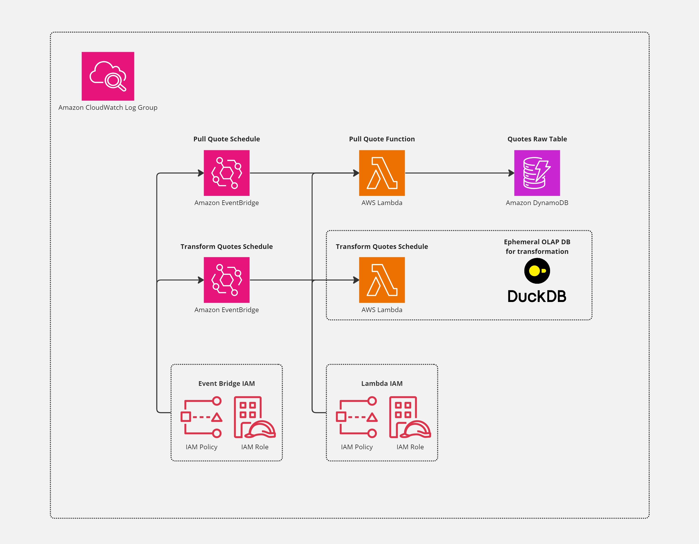

<div align="center">
    <h1>Serverless AWS ELT Demo</h1>
    <i>A learning repo to demo a cheap, fast, and serveless data stack</i>
</div>
<br>
<p align="center">
  
  
</p>
 
## Introduction
This is a lightweight demonstration of a serverless data stack, emulating one that could be found across many data teams' workflows today. Currently, this encompasses ingestion via an API, loading into DynamoDB, and light transformation in DuckDB. Note: duckdb is an in memory OLAP db, which means for the use case here, it is ephemeral. We have no need to retain the data for demonstration purposes, however one could easily adapt this project to do so. All of this is built on AWS serverless infrastructure, which results in an extremely cheap, fast, and infinitely scalable template.

All of the infrastracture is created and modified via IaC (infrastructure as code) using Terraform. You shouldn't even need to lift a finger in the actual AWS console!

This project is entirely free to run on the AWS "Always Free Tier", assuming you don't have heavy load across DynamoDB, Lambda, or EventBridge Scheduler elsewhere that takes you over the limit.

#### Technologies Used
- DuckDB
- Terraform (IaC)
- AWS Lambda
  - Lambda Layers
- API
- AWS DynamoDB
- AWS EventBridge Scheduler
- AWS IAM
  - Roles
  - Policies


## Table of Contents
- [Introduction](#introduction)
    - [Technologies Used](#technologies-used)
- [Table of Contents](#table-of-contents)
- [Purpose](#purpose)
- [Architecture](#architecture)
    - [Explained in a bit more verbose way](#explained-in-a-bit-more-verbose-way)
- [API Used](#api-used)
- [Setting Up the Project](#setting-up-the-project)
- [Credits](#credits)
- [License](#license)


## Purpose
Ultimately, there is not much point beyond being a teaching resource, and demonstrating best practices across a fairly modern stack (or at least a slice of one). I will continue to build out the stack over time, to make a more holistic stack following the same "cheap, fast, serverless" ethos.


## Architecture
Below is a diagram describing the high-level architecture



#### Explained in a bit more verbose way
We effectively have two Lambda functions (`pull_quote` and `transform_quotes`) handling the heavy lifting and all of the compute. 

`pull_quote` is tasked with hitting the chosen API, applying light transformation (renaming of columns, etc), and then using boto3 to load the data into a DynamoDB, `quotes_raw`. In this instance, we have a hash key of the non-unique `ingested_date`, and a range key of the `ingested_at`. Note: dynamo db allows non-unique hash keys, when the combination of a hash and range key creates a unique surrogate key.

`transform_quotes` is tasked with taking our DynamoDB table from before, and pulling only the prior date's ingested quotes. From here, it dumps the data to json, loads it into DuckDB, and begins a series of transformations and CTAS statements to emulate a simple DWH workflow. In this pared down example, we create a `quotes_fact` and `quotes_agg` table in DuckDB. Additionally, we pull several high level descriptive statistics for logging. One could utilize a metadata store, and eventually begin monitoring these values for simplistic data quality monitoring. 

A common environment is shared across both lamba functions, which is established via a lambda layer. This ensures both stay in sync, and allow us to apply this elsewhere. It also cuts down on deployment time, as some of these python libraries are large and it means we only zip and upload them once! 

Both lambdas are triggered by separate EventBridge Schedules. `pull_quote` is set at a 1 minute interval, and `transform_quotes` occurs once daily.

A central log group collects the logging information for all of the resources. We also apply individual IAM roles and policies to each functional unit for best practice (with the minimal permissions needed to function).


## API Used
For this project, I chose to use an open-source, free API to keep things approachable.

After perusing [this list of public API's](https://github.com/public-apis/public-apis), I settled on the [quotable API](https://github.com/lukePeavey/quotable). I've always loved quotes, so this felt up my alley.

## Setting Up the Project
The setup is simple, so follow along if you care to :)

1. Dependencies
   `Terraform` - allows for IaC deployment of AWS resources
   `AWS account` - hopefully you are a root user (but use a different IAM user!!) and can manage the necessary permissions, or you have a role with sufficient perms already
   `~.aws\credentials` - must have a set of AWS credentials for Terraform to use. This is the standard directory, but feel free to adjust the terraform commands if you use a different location (again, don't use your root user)
   `python, version = 3.12.2` - technically you don't need this, but if you want to change packages, run locally, etc you at least need a python3 install
2. Clone the repository into your desired directory
   ```
   cd .\Documents\github\
   git clone https://github.com/hscopalm/serverless-quote-elt.git
   cd .\serverless-quote-elt\
   ```
3. Create a venv, activate it, install packagages, and install into the lambda target
   ```
   python -m venv serverless-quote-elt-venv
   .\Scripts\Activate.ps1
   pip install -r requirements.txt
   mkdir .\serverless-quote-elt-venv\lambda-layer-site-packages
   mkdir .\serverless-quote-elt-venv\lambda-layer-site-packages\python
   pip install -target .\serverless-quote-elt-venv\lambda-layer-site-packages\python -r requirements.txt
   ```
4. Verify terraform is installed
   `terraform --version`
5. Initialize terraform to create tf files, and prep for deploying resources
   `terraform init`
6. Plan and inspect the result of `main.tf`
   `terraform plan`
   Make sure the resources in my script are what you want, and that they won't blow your budget
7. Apply the plan
   `terraform apply`, followed by `yes` once prompted
   Terraform will now begin managing your state, and keep it up to date if you make changes
8. Navigate to the Schedule, Lambda, DynamoDB table, and CloudWatch Logs
   Verify they have been created as expected, and watch the logs populate with some fun quotes!
9.  If you want to kill the resources, run `terraform destroy`

## Credits
The only resource directly used by this project (other than AWS services) is the [quotable API](https://github.com/lukePeavey/quotable), started by Luke Peavey. Thanks for the resource Luke!

## License
This project is under the MIT License, feel free to use however you see fit!